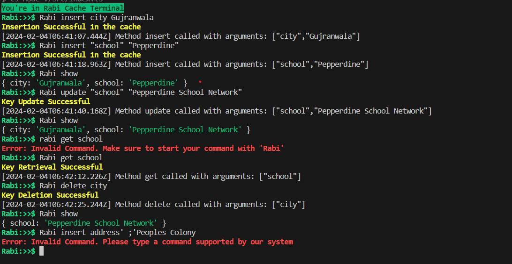

# Rabi Cache

Welcome to Rabi Cache, a personal project aimed at creating an in-memory cache similar to Redis. In the current implementation, users can insert, add, delete, and update data in the cache by interacting with the commandline.

# Features:

- `User Data Caching`: `Rabi Cache` allows users to cache their data.
- `Rabi Protocol`: A text-based protocol designed for interaction with the cache..
- `Command-Line Interface (CLI)`: Interact with the cache by entering commands in the Rabi Protocol.

# Future Enhancements

In the upcoming releases, the following functionalities are planned for incorporation:

- `Accepting Connections`: Enable `Rabi Cache` to accept and handle external connections.
- `Key Expiry Timer`: Implement a timer mechanism to automatically expire keys based on a predefined timeframe.
- `Cache Eviction Policies`: Introduce policies to efficiently manage cache space and evict items when needed.
- `Accepting Mixed Cases`: Parser should handle a situation where the key and value contain a mix of single and double quotes.

# Supported Commands

```bash
Rabi insert key value # Inserting a key-value pair in cache
Rabi update key value # Updating a key-value pair in cache
Rabi delete key # Deleting a key-value pair by passing the key
Rabi get key # Getting the value by passing the key
Rabi show # Logging the key-value pairs present in the cache
```

# CLI Snapshot


